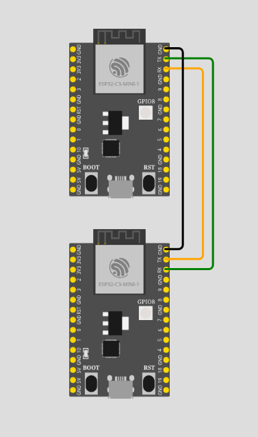

# esp32c3 UART communication

This project demonstrates asynchronous communication between two `esp32c3` MCUs via UART using `embassy` framework.

For the communication to work, connect microcontrollers as follows:

